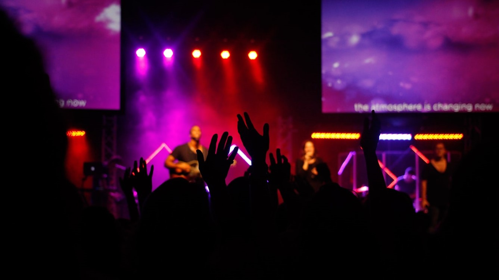

There's a lot that we do before actually starting the project. We do market research and analysis, understand the competitive landscape, understand and document clients’ design and branding preferences, consult with all the key stakeholders and finally come up with a high-level mapping. This brings alignment in terms of end-user persona and business needs.

[row]
[col]

Lorem ipsum dolor sit amet, consectetur adipisicing elit

[/col]
[col]

Lorem ipsum dolor sit amet, consectetur adipisicing elit

[/col]
[/row]

[row]
[col]

Lorem ipsum dolor sit amet, consectetur adipisicing elit

[/col]
[/row]

[row]
[col]

Lorem ipsum dolor sit amet, consectetur adipisicing elit

[/col]
[col]

Lorem ipsum dolor sit amet, consectetur adipisicing elit

[/col]
[col]

Lorem ipsum dolor sit amet, consectetur adipisicing elit

[/col]
[/row]
