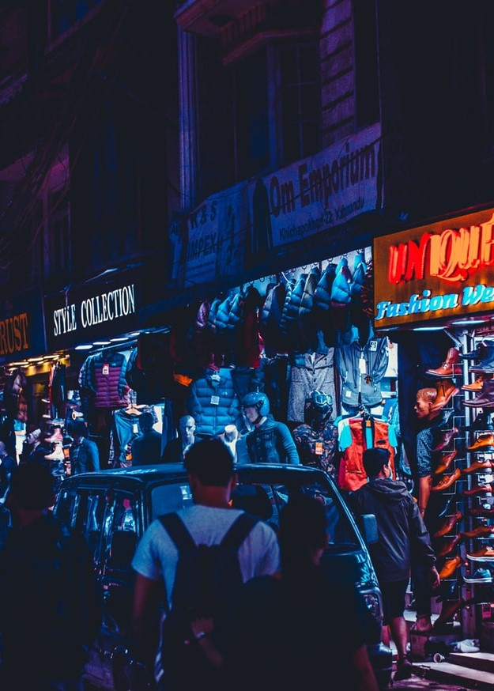

Our next step is to design the UI of all the project screens based on the approved wireframes and design guidelines. Our focus on creating the design is to best represent your brand and improve your digital presence. Also, we make sure to deliver a clickable prototype on Invision platform. We develop an interactive prototype, allowing you to preview the user-experience and simulate the flow, prior to development.

[row]
[col]

Lorem ipsum dolor sit amet, consectetur adipisicing elit

[/col]
[col]

Lorem ipsum dolor sit amet, consectetur adipisicing elit

[/col]
[/row]

[row]
[col]

Lorem ipsum dolor sit amet, consectetur adipisicing elit

[/col]
[/row]

[row]
[col]

Lorem ipsum dolor sit amet, consectetur adipisicing elit

[/col]
[col]

Lorem ipsum dolor sit amet, consectetur adipisicing elit

[/col]
[col]

Lorem ipsum dolor sit amet, consectetur adipisicing elit

[/col]
[/row]
